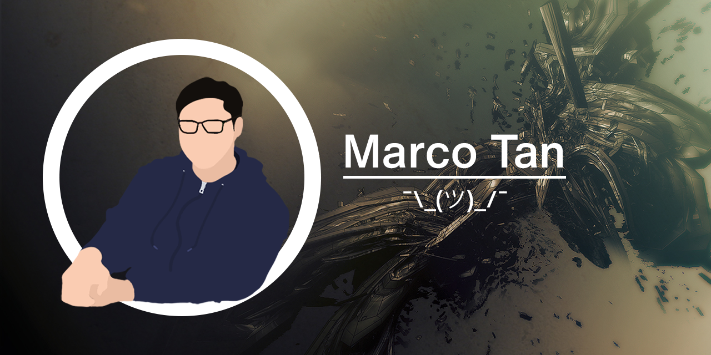

    
     
     
    
    
    
    

#  

My name's Marco and I'm just your average STEM enthusiast. Though I don't really participate much in open-source projects, I would really like to try it sometime.

Currently, I do systems programming with my Arduino R3 and Due, and for my VRC team as the lead programmer. Check out my team (1104A) [here](https://github.com/Discobots-1104A)!

*ima go toil over school work and stuff now k thx*

<h3 align="center">Languages and Tools</h3>

    
    
    
     
    
    
    

 
<h6 align="center"><strike>bruh this README isn't even in markdown anymore it's all HTML</strike></h6>
